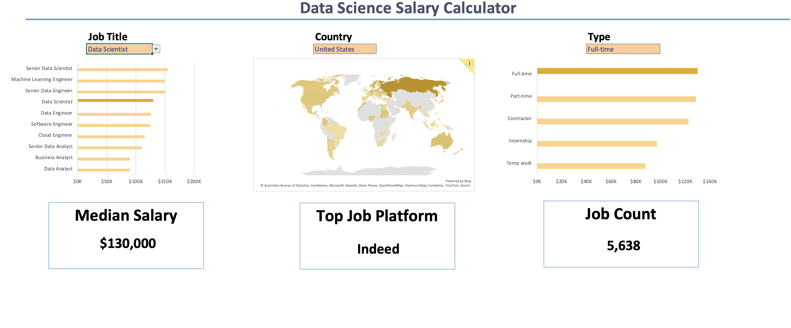

# Data Jobs Dashboard

This project is an Excel-based analytics dashboard built from a data jobs salary dataset. It summarizes compensation and job-market patterns with interactive filters and visual summaries, all inside a single workbook.

## Overview

The dashboard is designed to answer a few quick questions:

- What are the salary differences across data-related job titles?
- How do salaries change by country and employment type?
- Which platforms contribute the most job listings?
- How many job records are included in the dataset?

## Dashboard Highlights

- Job Title filter to focus on a specific role, such as Data Analyst or Data Scientist.
- Country filter to compare salaries and listings across regions.
- Type filter to separate full-time, part-time, contractor, internship, and mixed-role records.
- Salary bar charts for job title and employment type comparisons.
- A world map view to show the geographic spread of the dataset.
- KPI cards for Median Salary, Top Job Platform, and Total Job Count.

## Included Files

- [Salary_Dashboard.xlsx](Salary_Dashboard.xlsx) - the main Excel workbook containing the dashboard and supporting data sheets.
- [UI.png](UI.png) - preview image of the dashboard UI.

## Workbook Structure

The workbook includes the dashboard plus supporting tabs for the cleaned data and lookup/validation tables used by the slicers and visuals.

## Preview

## Notes

- The workbook is intended to be opened in Microsoft Excel.
- The visuals and filters are interactive inside the workbook.
- If you add generated exports or temporary analysis files later, a `.gitignore` can be added then, but it is not necessary for the current repo contents.

